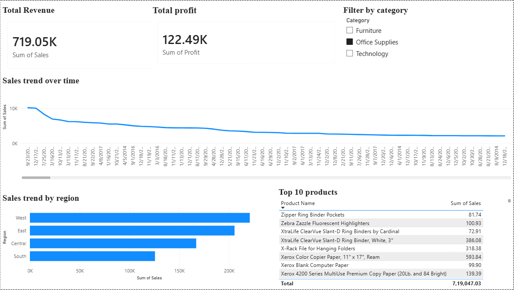
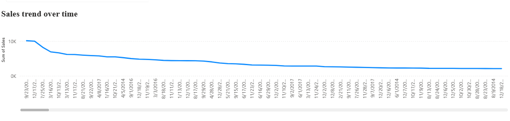
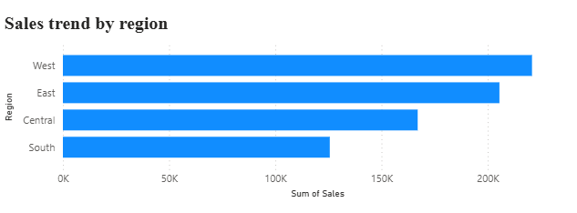

# Retail Business Insights Engine

---

## Project Overview

Retail Business Insights Engine is an **end-to-end data analytics project** that simulates a real-world retail business analysis workflow.

The project demonstrates how raw business data can be transformed into **actionable insights** using modern data analytics tools.

This project covers the complete analytics pipeline:

Raw Data → Data Cleaning → SQL Business Queries → Power BI Dashboard → Business Insights

The objective is to help stakeholders understand **sales performance, regional trends, and top-performing products**.

---

## Tech Stack

Python (Pandas, Matplotlib)  
SQL (SQLite)  
Power BI  
Git & GitHub  

---

# Dashboard Preview

## Main Dashboard

## Sales Trend Over Time

## Top Products

## Sales by Region

---

# Data Cleaning (Python)

Data cleaning was performed using **Python and Pandas** to prepare the dataset for analysis.

Steps performed:

• Loaded dataset using Pandas  
• Checked missing values  
• Removed duplicates  
• Standardized column names  
• Converted data types  
• Saved cleaned dataset

# Database & SQL Analysis

The cleaned dataset was stored in a SQLite database for business queries.

Example SQL queries:

Total Sales
SELECT SUM(Sales)
FROM sales;
Sales by Region
SELECT Region, SUM(Sales)
FROM sales
GROUP BY Region;
Top Products
SELECT Product_Name, SUM(Sales)
FROM sales
GROUP BY Product_Name
ORDER BY SUM(Sales) DESC
LIMIT 5;
Power BI Dashboard

The dataset was connected to Power BI to build an interactive dashboard.

# Dashboard includes:

• Total Revenue KPI
• Sales by Region
• Top Products by Sales
• Sales Trend Over Time

The dashboard allows stakeholders to quickly understand business performance and trends.

# Key Insights

Some insights derived from the dashboard:

• The West region generates the highest revenue
• A few products contribute to a large share of sales
• Sales trends show seasonal fluctuations across months

These insights can help businesses improve inventory planning and sales strategy.

# Skills Demonstrated

This project demonstrates key Data Analyst skills:

Data Cleaning using Python
Exploratory Data Analysis
SQL Business Queries
Power BI Dashboard Design
End-to-End Analytics Workflow

# Future Improvements

Possible improvements to the project:

• Add Profit Analysis
• Add Customer Segmentation
• Build Sales Forecasting Model
• Deploy Dashboard using Power BI Service

# 👨‍💻 Author

Abhyudaya Mahapatra

Aspiring Data Analyst | Python | SQL | Power BI

